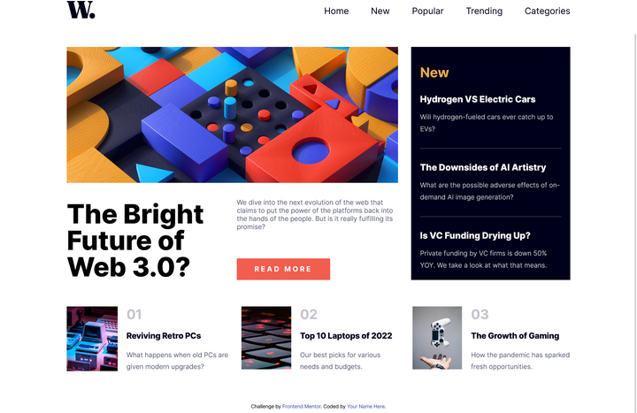

# Frontend Mentor - News homepage solution

This is a solution to the [News homepage challenge on Frontend Mentor](https://www.frontendmentor.io/challenges/news-homepage-H6SWTa1MFl). Frontend Mentor challenges help you improve your coding skills by building realistic projects. 

## Table of contents

- [Overview](#overview)
  - [The challenge](#the-challenge)
  - [Screenshot](#screenshot)
  - [Links](#links)
- [My process](#my-process)
  - [Built with](#built-with)
  - [What I learned](#what-i-learned)
  - [Continued development](#continued-development)
  - [Useful resources](#useful-resources)
- [Author](#author)

**Note: Delete this note and update the table of contents based on what sections you keep.**

## Overview

### The challenge

Users should be able to:

- View the optimal layout for the interface depending on their device's screen size
- See hover and focus states for all interactive elements on the page
- **Bonus**: Toggle the mobile menu (requires some JavaScript) Done!

### Screenshot




### Links

- Solution URL: [GitHub](https://github.com/Franche020/news-homepage-main)
- Live Site URL: [GitHubPages](https://franche020.github.io/news-homepage-main/)

## My process

### Built with

- Semantic HTML5 markup
- CSS custom properties
- Flexbox
- CSS Grid
- Mobile-first workflow
- Javascript
- SASS
- GULP


### What I learned

I learned how to modify style properties from Javascript, and how to detect window viewport through .onresize method

```js
 window.onresize = function () {
    anchoCliente = window.visualViewport.width;
    if (anchoCliente > 768) {
      barraGrande("flex", "none", "none");
      menuMostrado = false;
```


### Continued development

I need to improve my coding in Javascript to create more efficient code

### Useful resources

- [Udemy Course (in spanish)](https://www.udemy.com/course/desarrollo-web-completo-con-html5-css3-js-php-y-mysql/) - Im studying this Udemy course and I learn really a lot

## Author

- Website (now on GitHub) - [Francisco J Casado](https://github.com/Franche020)
- Frontend Mentor - [@Franche020](https://www.frontendmentor.io/profile/Franche020)

